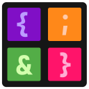

 

# Code Deck

- [Code Deck](#code-deck)
  - [Description](#description)
  - [Plugins](#plugins)
  - [Supported Stream Decks](#supported-stream-decks)
    - [Tested Stream Decks](#tested-stream-decks)

## Description

**Code Deck** is an open source alternative to the official Stream Deck application.

The `Code`-part of the name is a reference to how configuration and plugins work in **Code Deck**. The configuration is done using `JSON` and all plugins are `C#`-scripts.

## Plugins

**Code Deck** supports plugins. Plugins are located in the `Plugins`-directory. All plugins are coded in `C#` and gets compiled on startup using `Roslyn`. All the *"builtin"* plugins work in the same way and their `C#`-scripts are available in the same `Plugins`-directory.

## Supported Stream Decks

**Code Deck** *should* work with any Stream Deck hardware supported by [`OpenMacroBoard` & `StreamDeckSharp`](https://github.com/OpenMacroBoard/StreamDeckSharp).

### Tested Stream Decks

| Stream Deck Hardware          | Status     | Notes                                    |
|-------------------------------|------------|------------------------------------------|
| Stream Deck Mini              | Untested   |                                          |
| Stream Deck (Standard) (MK.1) | ✔️         |                                          |
| Stream Deck (Standard) (MK.2) | Untested   |                                          |
| Stream Deck +                 | Untested   | Stream Deck + has an additional screen (or screen area at least) and rotary knobs. The "standard" buttons might work. |
| Stream Deck XL                | Untested   |                                          |
